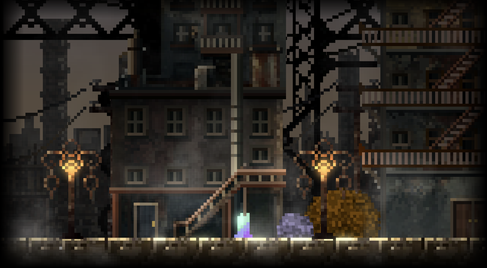
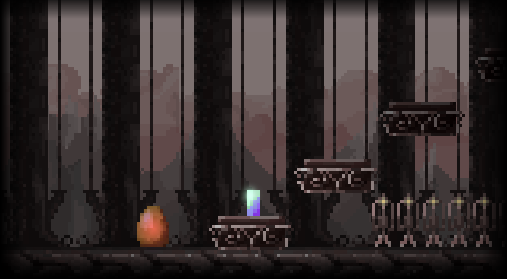
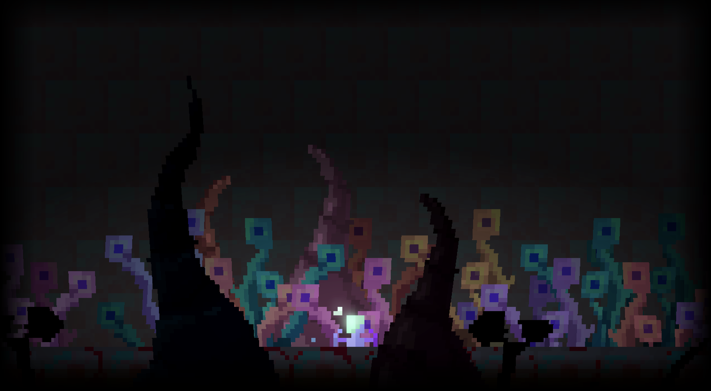
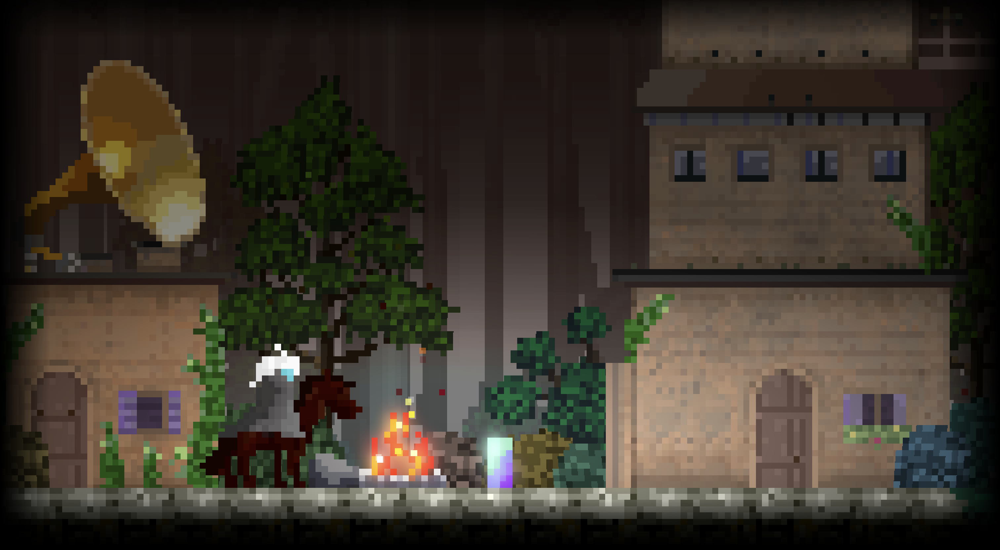
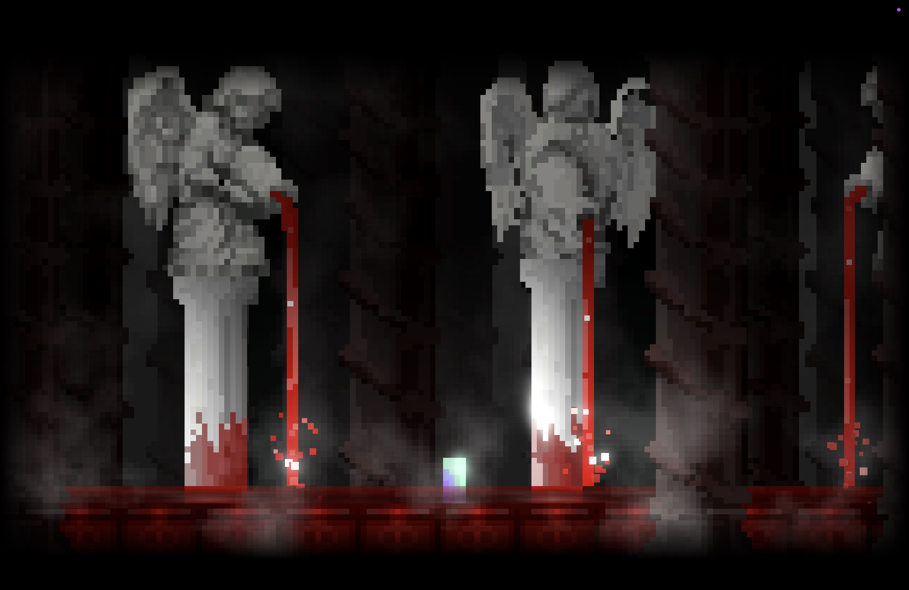
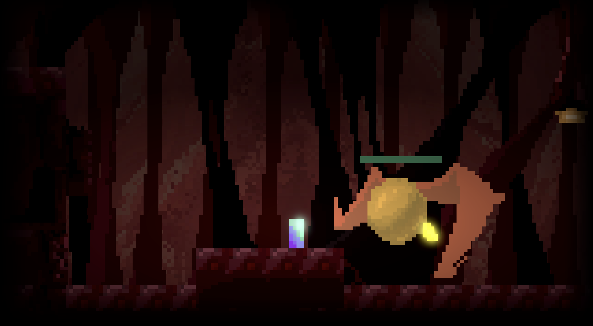

# Phage

**A fantasy action-adventure carried by one tiny hero.**

*One protagonist. A handful of pixels. A whole world to cross.*

---

## Gallery

<table>
<tr>
<td> <b>Rust City</b></td>
<td> <b>Salt Land</b></td>
</tr>
<tr>
<td> <b>Cradle Corridor</b></td>
<td> <b>Silvaron</b></td>
</tr>
<tr>
<td> <b>Crimson Sanctum</b></td>
<td> <b>Spawn Room</b></td>
</tr>
</table>

> **More coming soon.** New regions, bosses and secrets are being added all the
> time — this is only a glimpse. Stay tuned, or play the game to see the rest.

---

## About

**Phage** is a 2D fantasy action-adventure. You play a lone hero — rendered in
extreme, deliberate low-pixel art — journeying through a strange and beautiful
world of ruined cities, silver forests, crimson sanctums and salt-bleached
wastes.

The heart of the game is simple: **a minuscule protagonist against an enormous
world.** The contrast between the ultra-low-resolution character and the
atmospheric, cinematic environments is the whole point — and the main draw.

And there's plenty of fighting to be done. The world is packed with **bosses** —
big, strange, and dangerous — along with all the enemies in between.

There is also a reason the hero is so small. Read on.

---

## Story — Seven Nights

Remi lives in a little attic room: a bed, a window, a coral fish tank, a potted
tree, a pink salt lamp, a wind-up tin robot, and an old wall clock that never
quite keeps time.

Remi has a secret nobody else knows: **whatever Remi's eyes rest on last before
sleep becomes that night's dream.**

In dreams, Remi is not Remi. Consciousness shrinks as it falls — down to a
figure just eight pixels tall — while the world grows vast around it. The coral
in the tank spreads into an undersea cradle; the salt lamp piles up into
bouncing pink mountains; the ticking of the tin robot swells into an entire
rusted city. The dreams are full of swarms, webs, and enormous creatures. But
Remi has never been afraid of dreaming. These dreams are Remi's own — and in
them, Remi knows how to fight.

On Monday night, turning a page before bed, the paper cut Remi's finger.
That night's dream ran red.

Seven nights. Seven dreams:

| Night | Dream | |
|---|---|---|
| Monday | **The Wound** | A dream stained red, where pain teaches you to run and to swing a sword. |
| Tuesday | **Coral Cradle** | The miniature world inside the fish tank — and Actinos, dwelling at the cradle's heart. |
| Wednesday | **Rust City** | The tin robot's city. Walk its lamps and rain, all the way to the arena where a champion slime waits. |
| Thursday | **A Mountain Made of Salt** | The pink ranges inside the salt lamp. The only way is up. |
| Friday | **The Web** | Overnight, the potted tree is wrapped in silk — and deep in the tangled forest, something is weaving. |
| Saturday | **The Forest's Gift** | By day, Remi gently clears the webs away. That night the forest shines silver, and the Crystal Guardian offers its thanks. |
| Sunday | **The Sabbath** | The old clock tolls the final dream. Its pendulum becomes a flying scythe, and in a crimson sanctum, the end of the week is waiting. |

When the seventh dream ends and morning light falls into the room, what wakes
up in the bed is not Remi —

**it is a wolf, wearing an explorer's hat.**

The second week begins.

---

## Status

In active development.

## Tech

- **Engine**: Godot 4.6.2.stable
- **Language**: GDScript
- **Art**: Aseprite (source files in `Aseprite Assets`, exported PNGs co-located with entities)
- **Audio**: TBD

## Credits

- Programming / Environment Artist / Music: Jiamu Shangguan
- Character Animator / Narrative Designer: Oscar Li
